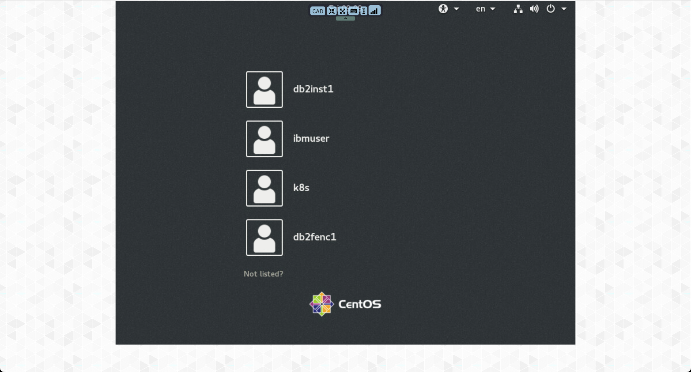
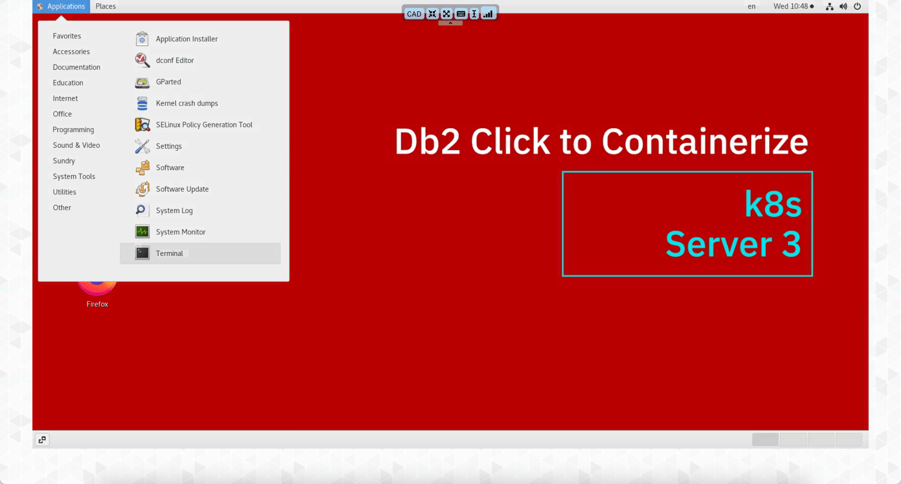
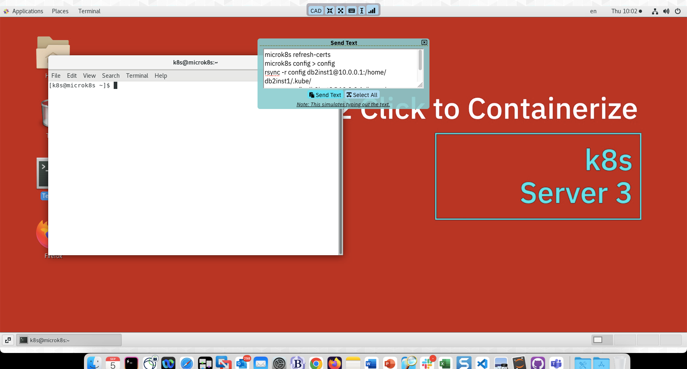

# Using the VM Remote Console

The server that has been provisioned has no physical monitor attached to it (headless is what it is commonly referred to) and so we need to use a different technique to view the desktop of the main user or the system.

Your workshop reservation contains details of the open ports of the server along with links to the Virtual Console.

Scrolling further down the page you will find the console buttons.

The server that you want to connect to is the K8S server (c2ck8slab) which should be the last button in the list. When you click on the blue button, a popup window will display with the log on screen.

You should immediately select the "Open in a new window" option so that you can clearly see the logon screen.

Clock on the bottom of the blue screen, and while holding the mouse button, swipe up to reveal the login user ids.

Select the K8S userid. The password is `engageibm`. 

You will now see the main screen of the k8s user. All the lab exercises will be done from within this environment. You can make the console occupy the entire size of the web browser window by using the menu found at the top of the screen. 

## Executing Commands in a Terminal Window

There will be a few commands that you will need to execute from a terminal window. To open a terminal window, click on the Terminal icon on the desktop.

This will open up a window on the desktop where you will be able to issue commands.

Alternatively, you can use the menu at the top of the screen (Applications) and select the terminal application. 

## Cut and Paste

When using the virtual console, you are not able to copy a string from your operating system (Windows or OSX) and paste it into the remote console. You must use the menu that is provided with the console to copy text into the system. The menu is found at the top of the virtual screen and provides options to resize the window, set a fixed size, and copy text into the server.

When you click on the text insert button (highlighted), the paste menu will appear.

Place the text you want to copy into the dialog box.

One you press "Send Text", it will copy the text into the currently open application. In this case, it is a terminal window.

