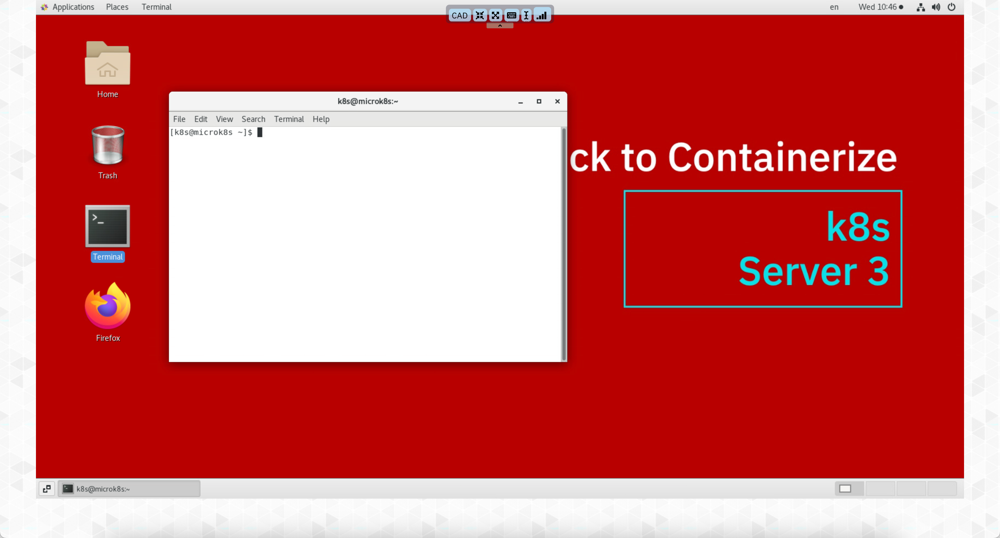

# Db2 Development with Jupyter Notebooks

To refresh the Db2 Development lab, make sure that you are using the VM Console and have opened a terminal window.



### Download the Latest Lab Contents

This will place the file into the Download directory of the k8s user.

!!! abstract "Download latest notebooks" 
    [Latest Lab Material](https://github.com/IBM/db2-summit-lab/raw/main/notebooks.zip)

!!! abstract "Recreate the notebook directory"
    ```bash
    rm -rf ~/notebooks
    unzip ~/Downloads/notebooks.zip
    ```

!!! abstract "Open the new Table of Contents"
    <a href="localhost:8888/Table_of_Contents.ipynb"_blank">Table of Contents</a>

