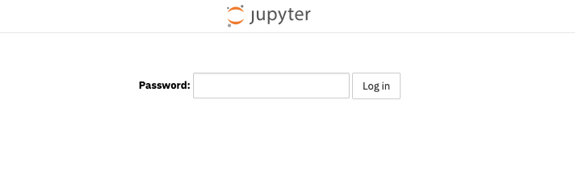
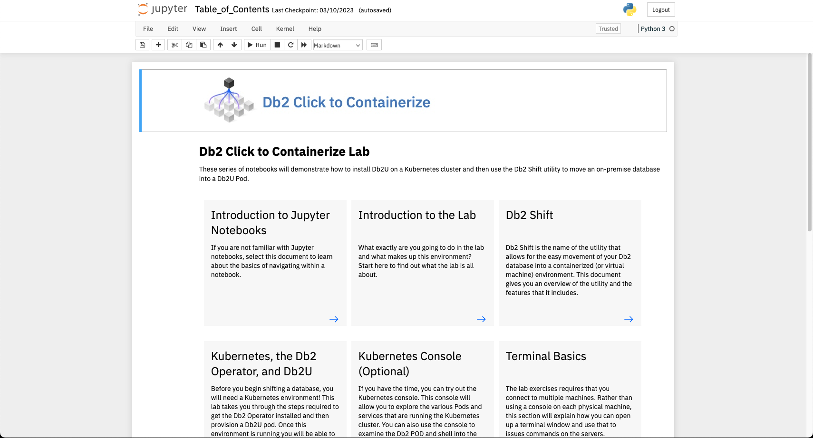
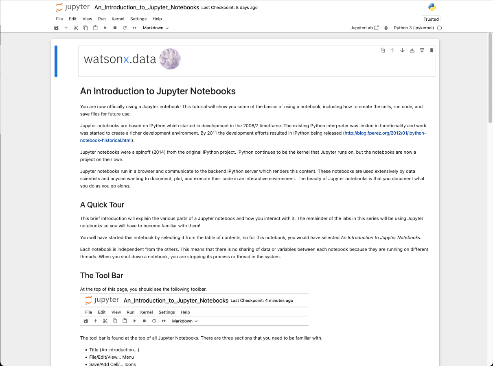

# Jupyter Notebook
The workshop includes a Jupyter Notebook service which provides an interactive way of exploring the features of the lab. The link to the Jupyter Notebook table of contents is provided in your workshop reservation.

!!! abstract "Find the URL in your reservation that reads Jupyter Notebook - Server: http://useast.services.cloud.techzone.ibm.com:xxxx/notebooks/Table_of_Contents.ipynb and click on it"

The initial screen will request that you enter a password.

!!! abstract "Enter kubernetes as the password"

 

Once you have authenticated, the main table of contents will be displayed. 

!!! info "The table of contents will be different for your workshop."

#### Introduction to Jupyter Notebooks

If you are not familiar with the use of Jupyter notebooks, this will be a good starting point. To view the notebook, click on the blue arrow found at the bottom of the box. This will open a new tab in your browser with the contents of the notebook. 

This notebook provides an introduction to what Jupyter Notebooks are and what the common tasks are that you can perform in a notebook.