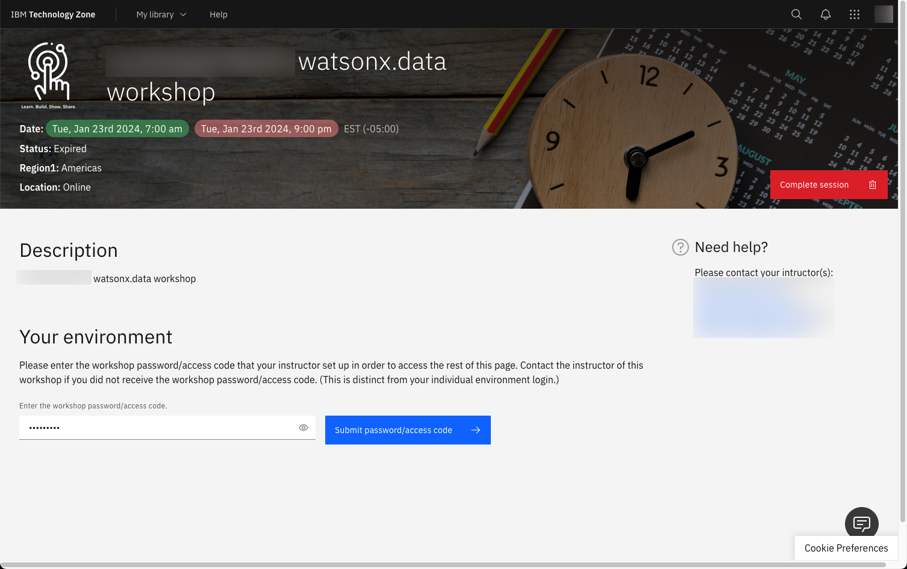
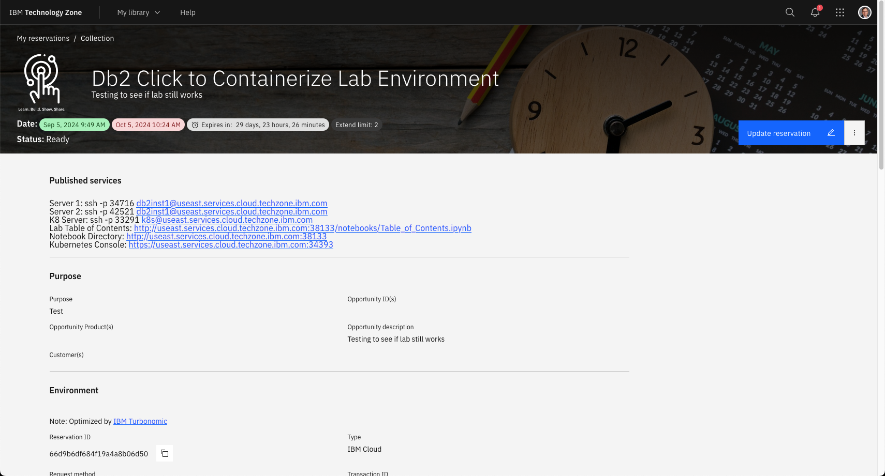
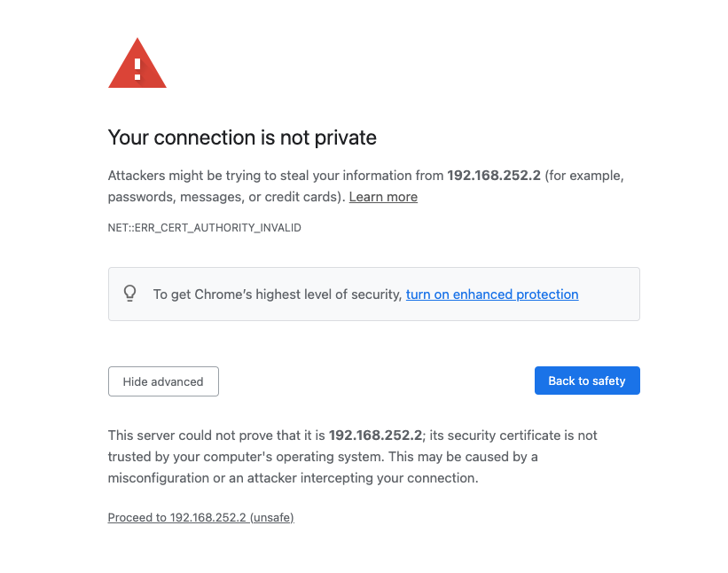

# Accessing a Workshop

To access a watsonx.data workshop, you will need to have an IBM userid and a link provided to your class instructor. The following link will connect you to the workshop reservation page.

!!! info "Db2 Summit Lab link" 
    <a href="https://ibm.biz/db2summit" target="_blank">Click to connect to the Db2 Summit Lab Reservation</a> 

This link will first ask you to log into the system using your IBM userid.

Once you are connected, a screen similar to the following will be displayed:

The title of the workshop will be different, but the steps to access the lab will remain the same. The class instructor will have provided a unique password for the course. Enter that value into the password/access code box and click on the Submit button.

When the connection is successful, the details of your environment will be shown in the browser.

The top of the page contains all the published services that you will use during the lab. For instance, if the lab requires that you access the Jupyter notebookm you would click on the link in this browser which says:

* Jupyter Notebook - <code>https://useast.services.cloud.techzone.ibm.com:xxxxx</code>

!!! warning "Workshop URLs" 

    Each user will have a unique set of URLs for their environment. Your URL service name and port number will be different than the examples shown in this lab. Make sure to use your URLs in any examples that require a server URL address and port number. 

## Certificate Errors 

The https links that are provided will result in a Certificate error in Firefox. Follow these steps to ignore the error when accessing these URLs.

 
Select Advanced.

 
Choose "Accept the Risk and Continue". If you are using Google Chrome, you can bypass the error message by typing in "thisisunsafe" or clicking on the "Proceed to 192.168.252.2 (unsafe)" link.

## Unable to Access External Links

If you are using a corporate laptop, you may be blocked from accessing sites that have self-signed certificates or web-sites that require a non-standard port (80, 443). In these situations you will use the VM Console to access the lab. 

!!! info "Console Versus Direct URL" 

    Be careful to follow the instructions in the lab to determine whether the command needs to be run from a URL (browser) or the Console (browser). The behavior of some commands will be different depending on which environment you are running in. 